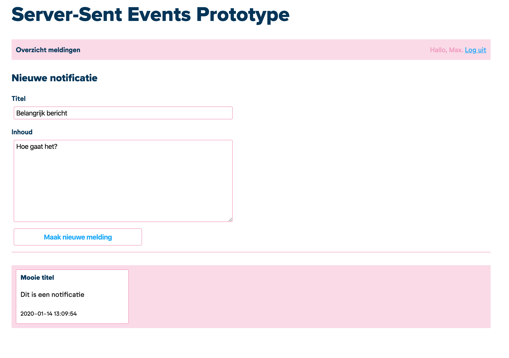

# Real-time-technologieën prototypes

Stageproject van Max Korlaar

De servers werken middels Docker-containers, zodat het niet nodig is om lokaal een webserver te installeren.

## Eisen
Docker moet geïnstalleerd zijn op je computer.

## Server-Sent Events

Start dit prototype door de volgende commando's uit te voeren in je terminal, nadat je in de juiste map bent genavigeerd:

```bash
cd server-sent-events
docker-compose up -d
```

Als alles goed is gestart, dan kan je het prototype nu in je browser benaderen door naar <http://localhost:8100> te gaan.
Het prototype ziet er als volgt uit, echter zonder inhoud in het grijze vlak:



Door nieuwe notificaties aan te maken middels het formulier, komen ze in de database met notificaties terecht. Ze zullen automatisch middels Server-Sent Events naar de browser gestuurd worden, en door JavaScript worden uitgelezen waardoor ze op de pagina belanden.
